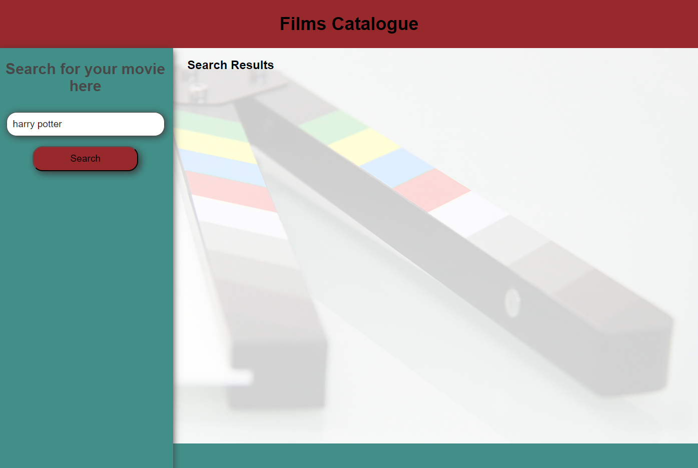
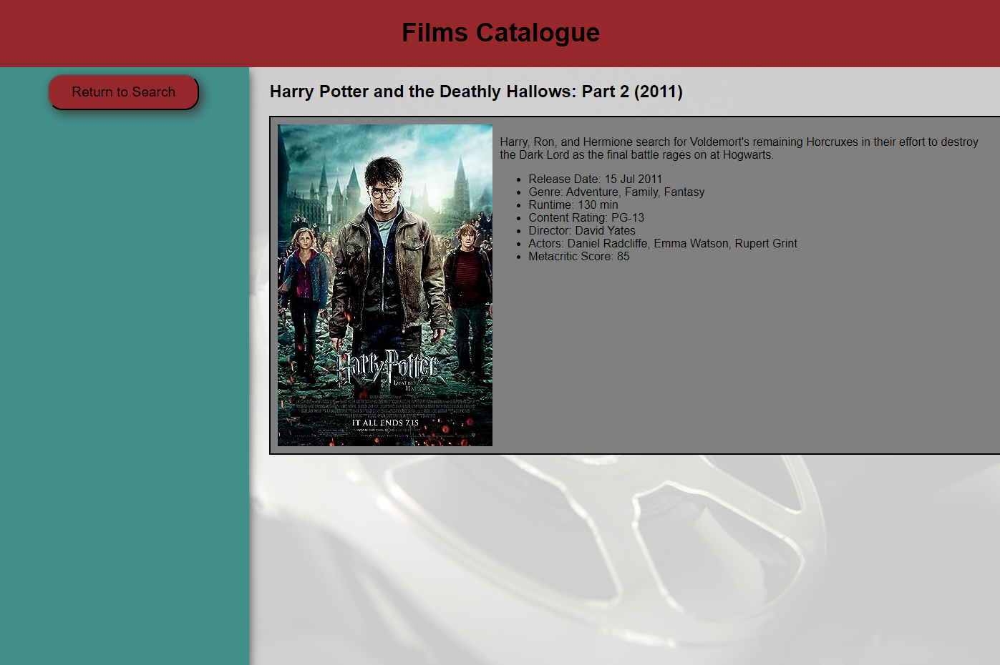

# Films Catalogue

## Description
This project is a website consisting of a movie search engine. It can be used to search for details about movies that are searched for. It is intended for users who are interested in finding out more about movies that they know little information about.
```
AS A movie consumer
I WANT to see rating and reviews of movies
SO THAT I can find what I want to watch
```

## Installation
The webpage is hosted online and can be accessed using the following link: https://christiehyde.github.io/FilmsCatalogue/

## Usage
Screenshots of the webpages are provided.


At the index page of the site, users can enter the title of a movie that they wish to search for. The search bar has autocomplete enabled so that previously searched titles are accessible.
Once submitted, the site will make an API request to the Open Movie Database and obtain data based on their closest matching movie title. Select pieces of information will be displayed on a search result card, which, when clicked, will load the movie details page.



The movie title from the previous page is passed to this one through the site's local storage. The script then uses this title to make a new API call, this time taking more data points to populate the page.
Users can click the "Return to Search" button to return to the index page and search for another movie.

## Credits
Source code has been produced by Christie Hyde, Zhenming Wang and Christopher von Altenstadt.

All movie information is sourced from the Open Movie Database (OMDB - https://www.omdbapi.com/) in accordance with their licensing agreement under CC BY-NC 4.0. We have no affiliation with the Database.